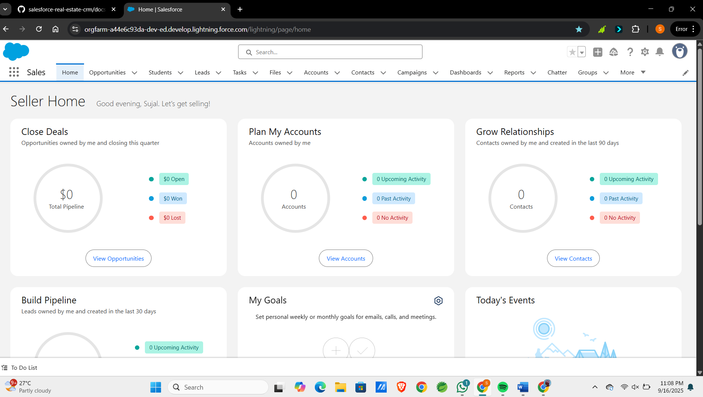
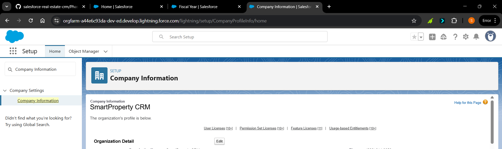
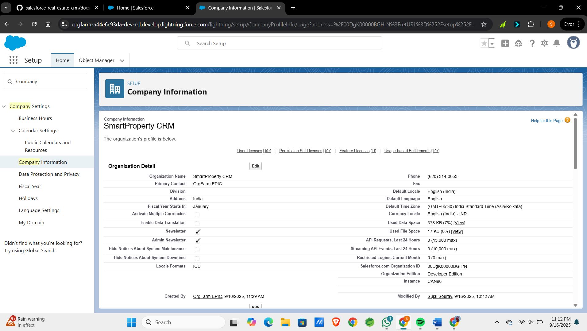
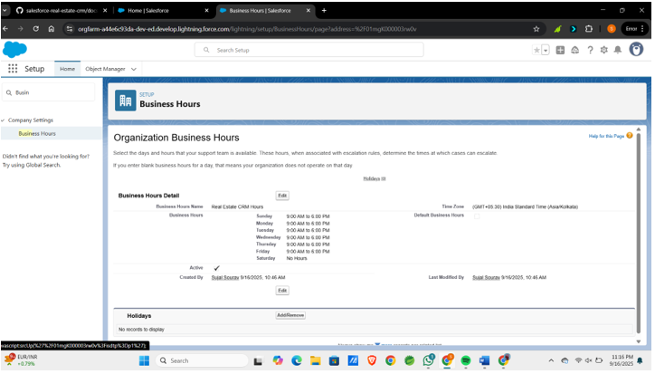
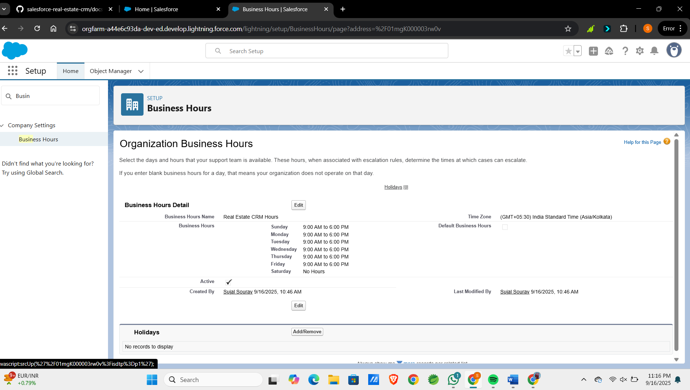
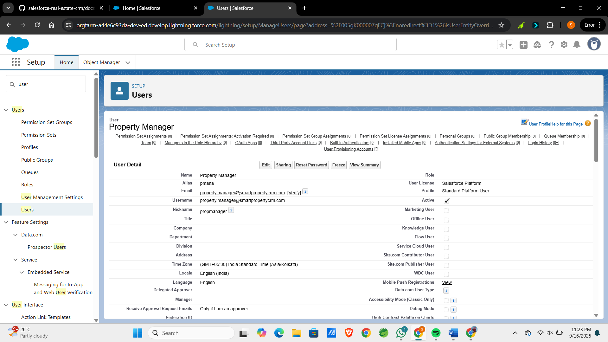
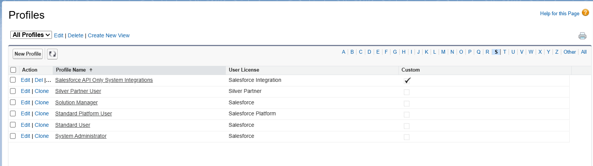
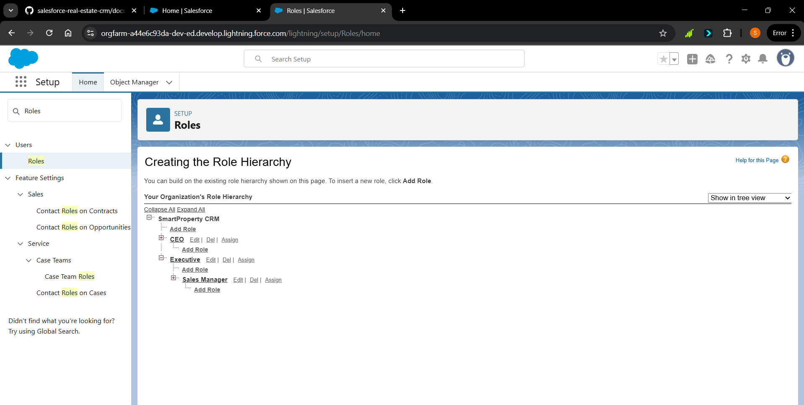
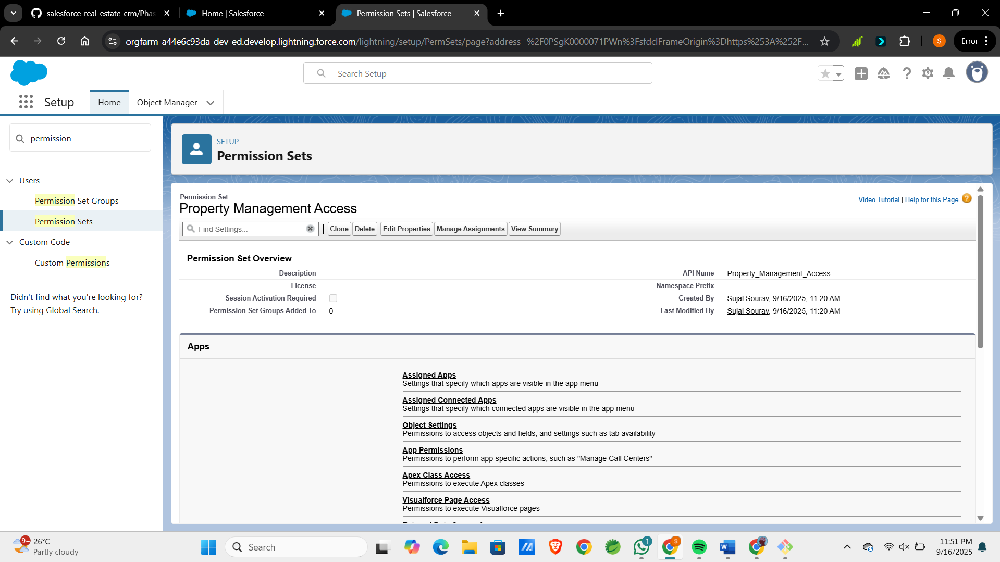
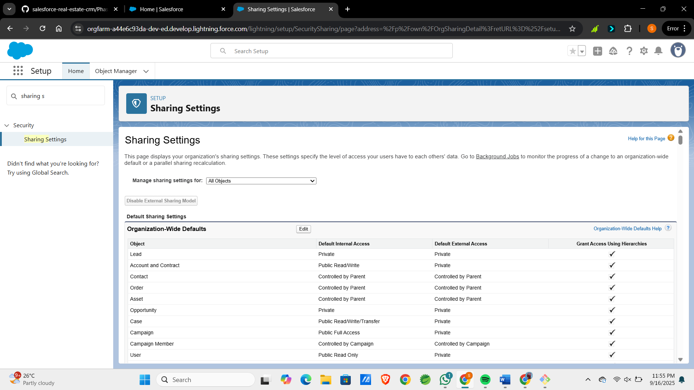

# 📸 Phase 2 – Proof of Work (Org Setup & Configuration)

This document contains screenshots of the Salesforce Org Setup, mapped to the key steps completed in Phase 2.

---

## 🔹 Step 1: Login & Dashboard

---

## 🔹 Step 2: Company Information Setup
- Company Name → SmartProperty CRM  
- Currency → INR (₹)  
- Locale → English (India)  
- Time Zone → (GMT +5:30) India Standard Time  

---

## 🔹 Step 3: Business Hours & Holidays

---

## 🔹 Step 4: Fiscal Year Settings

---

## 🔹 Step 5: User Setup
Created users:
- Sales Agent (Standard Salesforce License)  
- Property Manager (Salesforce Platform License)  
- Sales Manager (Standard Salesforce License)  

---

## 🔹 Step 6: Profiles
Cloned Standard User → Created **Sales Agent Profile**  

---

## 🔹 Step 7: Roles
Defined role hierarchy:
- Executive (Top)  
- Sales Manager  
- Sales Agent  

---

## 🔹 Step 8: Permission Sets
Created Permission Set → **Property Management Access**  

---

## 🔹 Step 9: OWD (Organization-Wide Defaults)
- Leads → Private  
- Opportunities → Private  
- Property (custom object – Phase 3) → Public Read/Write  

---

## 🔹 Step 10: Sharing Rules
Created rule to share Leads between teams  

---

# ✅ Proof of Work Summary
- Org setup completed successfully  
- 10 configuration steps documented with screenshots  
- Ready for Phase 3 (Data Modeling)  
